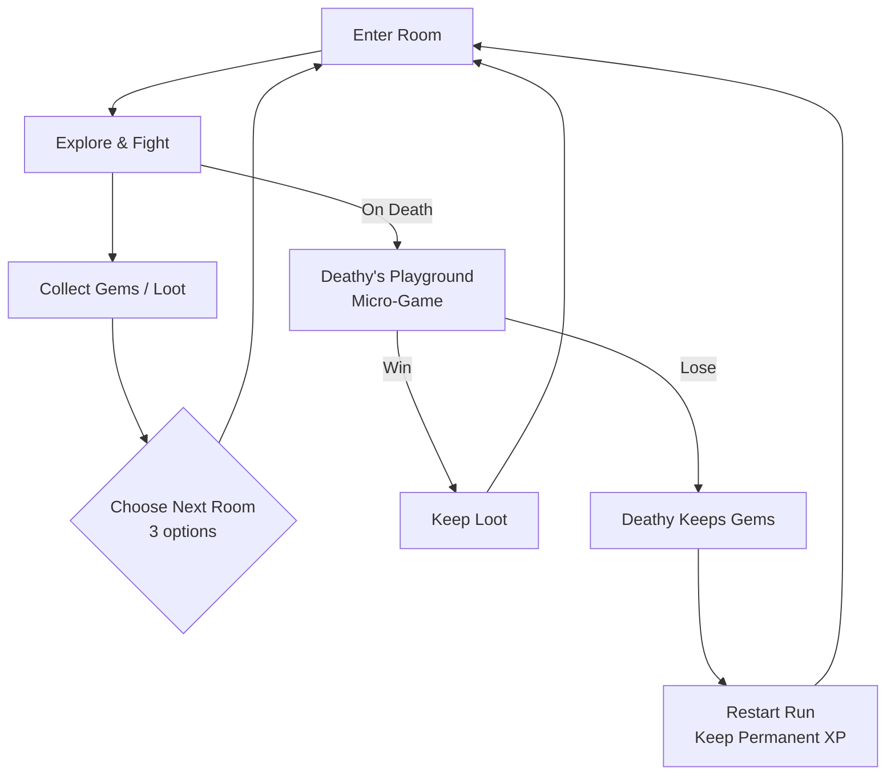
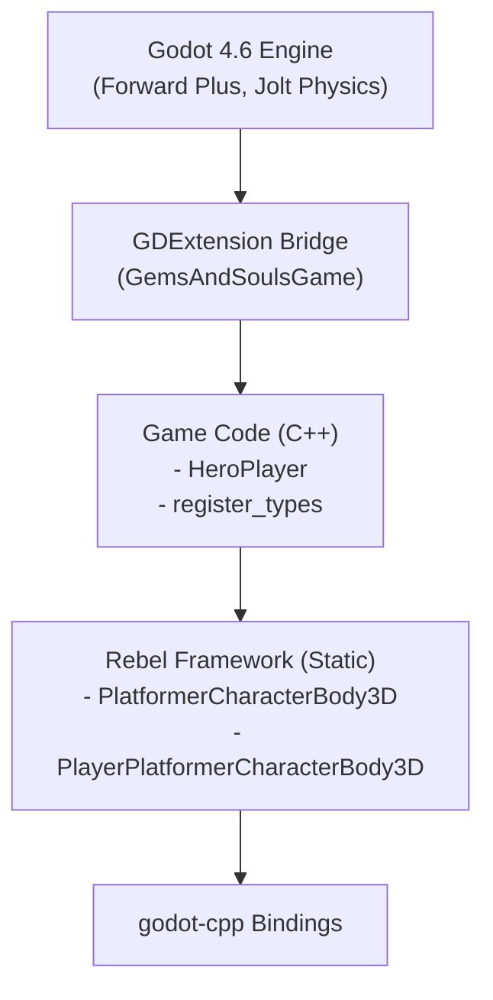

# Gems and Souls
## Game Design Document

> **Genre:** Top-Down Rogue-like with RPG Elements

> **Platform:** PC (Godot 4.6 + C++/GDExtension)

> **Target Audience:** Core gamers and casual RPG fans — difficulty scales via optional challenge rooms

> **One-Line Pitch:** Death isn't game over — it's an invitation to a rigged game of hide-and-seek with the Grim Reaper's bored, toy-collecting son.

---

## Table of Contents

- [1. Game Overview](#1-game-overview)
- [2. Core Gameplay Loop](#2-core-gameplay-loop)
- [3. Game Mechanics](#3-game-mechanics)
- [4. Systems Design](#4-systems-design)
- [5. World & Level Design](#5-world--level-design)
- [6. Narrative](#6-narrative)
- [7. Art Direction](#7-art-direction)
- [8. Audio Design](#8-audio-design)
- [9. User Interface](#9-user-interface)
- [10. Technical Specifications](#10-technical-specifications)
- [11. Production](#11-production)
- [Appendix](#appendix)

---

## 1. Game Overview

### 1.1 Concept

**Gems and Souls** is a top-down rogue-like where players explore procedurally-arranged rooms, fight enemies, collect gems, and make meaningful decisions — all under the watchful eye of **Deathy**, the Grim Reaper's young son.

The hook: when the Grim Reaper is too busy to collect your soul, Deathy takes over. Bored and lonely, he has turned the afterlife into his personal toybox, and you are his favorite new action figure. Death isn't a "Game Over" — it's an invitation to a rigged game of hide-and-seek in **Deathy's Playground**.

The twist: instead of a conclusion, death is a **high-stakes transition**. When your health hits zero, you don't restart — you are pulled into Deathy's bedroom for a chaotic micro-game. Win, and you keep your loot and skills. Lose, and the kid keeps your shiny gems for himself.

### 1.2 Core Fantasy

The player is a soul trapped in Deathy's domain, navigating rooms that shift between the living world and the afterlife. Every run feels like a game within a game — you're both the adventurer *and* the toy. The tension between progressing through dangerous rooms and the looming threat of Deathy's micro-games creates a unique risk/reward dynamic.

### 1.3 Unique Selling Points

- **Death as Transition:** Dying triggers a micro-game in Deathy's Playground rather than a restart. Win to keep your loot; lose to forfeit your gems.
- **Dual Difficulty Tracks:** Normal rooms offer progressive challenge; marked doors lead to optional high-risk/high-reward rooms.
- **Rogue-like Choice System:** Choose from 3 options at decision points (rooms, upgrades, paths), blending rogue-like randomness with player agency.
- **Permanent Progression:** In-game experience carries between runs as permanent attribute upgrades, so every loop makes you stronger.
- **Decision Memory:** Player choices are tracked and influence future encounters, narrative, and Deathy's behavior.

### 1.4 References & Inspirations

> [!QUESTION] What are the primary game references and inspirations? (e.g., Hades, The Binding of Isaac, Slay the Spire, WarioWare for the micro-games?)

---

## 2. Core Gameplay Loop

### 2.1 Primary Loop

1. **Enter a room** — combat encounters, puzzles, or narrative events.
2. **Clear the room** — defeat enemies, solve challenges, collect gems and items.
3. **Choose your path** — pick from three rogue-like options (next room, upgrade, event).
4. **On death** — transition to Deathy's Playground micro-game.
5. **Micro-game outcome** — win to continue with loot; lose to restart the run but keep permanent XP.

### 2.2 Secondary Loops

- **Permanent Progression Loop:** Gathered in-game experience converts to permanent attribute upgrades between runs. Each run starts slightly stronger.
- **Decision Loop:** Choices made during a run (spare an NPC, take a risk, choose a path) are remembered and affect future runs, room generation, and Deathy's dialogue.
- **Challenge Room Loop:** Marked doors indicate optional high-difficulty rooms with greater loot. Risk/reward decision for experienced players.
- **Gem Economy Loop:** Gems are the primary currency — used for upgrades, but also what Deathy steals on failed micro-games. Managing gem risk is a meta-strategy.

### 2.3 Session Structure

> [!QUESTION] What is the target run length? (e.g., 15-20 minutes per run, 5-10 rooms per floor?)

---

## 3. Game Mechanics

### 3.1 Player Mechanics

The player character is a 3D humanoid navigating a top-down world. Core mechanics:

- **Movement:** WASD-based 3D movement with acceleration/deceleration curves for responsive but smooth feel. Configurable speed (default 8.0 units/s), acceleration time (0.3s), and deceleration time (0.2s).
- **Jumping:** Variable-height jump with hold mechanics. Initial force (8.0), hold force (35.0), max hold time (0.5s), and early-release velocity cut (25%).
- **Rotation:** Character faces movement direction with smooth interpolation (rotation speed multiplier: 15.0).

> **Technical Note:** Movement is implemented in `PlayerPlatformerCharacterBody3D` (Rebel Framework) with ease-in/ease-out acceleration curves. See `cpp/RebelFramework/src/PlayerPlatformerCharacterBody3D.cpp`.

### 3.2 Combat System

Combat uses a dual-attack charge system:

- **Attack 1 (F key):** Primary attack — tap for quick strike, hold to charge for a power attack.
- **Attack 2 (G key):** Secondary attack — different attack type with its own charge mechanic.
- **Charge Mechanic:** Both attacks support hold-to-charge (default charge time: 1.0s). Charge level (0.0–1.0) is emitted via signal on release.

> **Technical Note:** Attack charging is implemented in `PlayerPlatformerCharacterBody3D`. Signals `attack1_released(charge_level)` and `attack2_released(charge_level)` are emitted. See `cpp/RebelFramework/include/Rebel/CharacterBody/PlayerPlatformerCharacterBody3D.hpp`.

> [!DECISION] Define attack design. Key questions:
> - What are Attack 1 and Attack 2? (e.g., melee swing vs. ranged projectile? light vs. heavy?)
> - How does charge level (0.0–1.0) scale? Linear damage? Threshold tiers (25%/50%/100%)?
> - Should full charge have a special effect (knockback, AoE, stun)?

### 3.3 Movement System

See [3.1 Player Mechanics](#31-player-mechanics) for core movement. Additional details:

- **Custom Gravity:** Configurable direction and magnitude (default: 30.0 units/s², terminal velocity: 120.0 units/s).
- **Physics Engine:** Jolt Physics 3D for collision detection and resolution.
- **Move-and-Slide:** Standard Godot CharacterBody3D integration for smooth collision handling.

### 3.4 Interaction System

- **Interact (E key):** Context-sensitive interaction with world objects, NPCs, items, altars.

> [!DECISION] Define interaction types and priority:
> 1. **Door entry** — normal and marked doors (core loop)
> 2. **Item/gem pickup** — auto-pickup radius vs. manual interact?
> 3. **Altar activation** — the altar system from the roadmap (see Section 4)
> 4. **NPC dialogue** — if NPCs exist in rooms
> 5. **Chest/container opening** — loot source

---

## 4. Systems Design

### 4.1 Progression System

**Dual Progression Model:**

1. **Per-Run Progression (Temporary):**
   - Rogue-like choices — pick 1 of 3 options at decision points (buffs, items, room paths).
   - Gems collected during the run serve as currency and risk asset.
   - Items and power-ups found in rooms.

2. **Permanent Progression (Across Runs):**
   - In-game experience (XP) gathered during runs converts to permanent attribute upgrades.
   - Attributes persist across all future runs, creating a meta-progression layer.
   - Each game loop starts stronger based on accumulated permanent upgrades.

> [!DECISION] Define the permanent attribute list (e.g., max health, base damage, speed, luck, gem magnet range) and their upgrade costs/scaling.

### 4.2 Economy System

- **Gems:** Primary currency. Collected from enemies, chests, and room rewards. At risk during Deathy's micro-games.
- **Experience (XP):** Earned from combat and exploration. Converts to permanent attribute upgrades. Not lost on death.

> [!DECISION] Define gem drop rates, micro-game gem stakes, and permanent upgrade costs.

### 4.3 Inventory System

> [!QUESTION] Will there be an inventory system? Or are items immediate-use / passive equipped slots?

### 4.4 AI Systems

**Enemy AI:**

> [!DECISION] Define enemy types, behaviors, and AI patterns for each room tier.

**Deathy AI:**

Deathy observes player decisions and adjusts his behavior accordingly. Player choices influence:
- Deathy's dialogue and personality during micro-games.
- The difficulty/type of micro-games triggered on death.
- Room generation and encounter balance in future runs.

### 4.5 Save/Load System

> [!DECISION] Define save structure. Suggested split:
> - **Persistent (saved to disk):** Permanent attributes, total XP earned, decision history, unlocked skins/characters, Deathy relationship state.
> - **Per-run (lost on quit):** Current room, current gems, temporary buffs, run-specific choices.
> - **Format:** JSON or Godot Resource? Consider ease of modding vs. save corruption risk.

---

## 5. World & Level Design

### 5.1 World Structure

The game world is divided into:

1. **The Living Rooms** — The main dungeon. Procedurally-arranged rooms with enemies, loot, and choices. Two door types:
   - **Normal Doors:** Lead to progressive-difficulty rooms.
   - **Marked Doors:** Lead to optional challenge rooms with greater loot.

2. **Deathy's Playground** — The afterlife micro-game arena. Triggered on death. A chaotic bedroom environment where Deathy sets the rules.

### 5.2 Level Design Principles

- **Rogue-like Room Selection:** At each room transition, the player chooses from 3 options (room types, paths, events).
- **Progressive Difficulty:** Normal path rooms scale in difficulty throughout a run.
- **Risk/Reward Branching:** Marked doors are always visible but optional — catering to both cautious and aggressive playstyles.
- **Decision Points:** Narrative and mechanical choices appear between rooms.

### 5.3 Environment Types

**Currently Available:**
- **Forest:** Kaykit forest environment with 8 color variants. MeshLib created for Color1. Trees, rocks, grass elements.
- **Prototyping:** Kenney prototype textures for blockout and testing.

> [!QUESTION] What other environment types are planned? (e.g., Dungeon, Graveyard, Deathy's Bedroom, Crystal Caves?)

---

## 6. Narrative

### 6.1 Story Overview

The Grim Reaper, overwhelmed with work, leaves soul collection duties to his young son, **Deathy**. Bored and lonely, Deathy doesn't just collect souls — he plays with them. He's turned his corner of the afterlife into a playground where souls must entertain him to earn their freedom (or at least, keep their shiny gems).

The player is the latest soul to catch Deathy's attention. Each run is a "play session" in Deathy's eyes. Win his games, and he might just let you go. Lose, and you're another toy in the box.

### 6.2 Characters

**The Player (Soul):**
- A recently deceased soul. Personality shaped by player decisions.
- Visual: Kaykit Protagonist B (medium rig, backpack-wearing adventurer).

**Deathy:**
- The Grim Reaper's son. Young, mischievous, lonely.
- Not evil — just a kid who doesn't understand the weight of death.
- His mood and behavior shift based on player choices and micro-game outcomes.

**The Grim Reaper (Mentioned/Background):**
- Absent father figure. Too busy to supervise Deathy.
- May appear in late-game narrative beats.

> [!QUESTION] Are there other NPCs the player encounters in rooms? (Merchants, trapped souls, mini-bosses with dialogue?)

### 6.3 Lore & Worldbuilding

> [!QUESTION] How deep should the lore go? Should there be collectible lore items that reveal backstory?

### 6.4 Dialogue System

> [!DECISION] Define dialogue approach. Consider a lightweight system:
> - **In rooms:** Minimal — short NPC text boxes, no branching mid-combat.
> - **Between rooms:** Decision prompts with 2-3 choices that feed into Decision Memory.
> - **Deathy's Playground:** Deathy speaks directly — taunts, rules, reactions to player choices. This is where personality shines.
> - **During runs (optional):** Deathy could commentate via floating text (like a bored kid narrating his toy's actions).

---

## 7. Art Direction

### 7.1 Visual Style

**Current Style:** Stylized 3D with Kaykit character and environment models. Colorful, chunky proportions. Not realistic — toy-like aesthetic that fits the "Deathy's Playground" theme.

### 7.2 Character Design

- **Player Character:** Kaykit Protagonist B — backpack adventurer with medium humanoid proportions.
- **Character Rig:** Medium skeleton rig with individual mesh parts (arms, legs, body, head, backpack).
- **Material:** StandardMaterial3D with albedo texture, 0.5 roughness.

**Available Character Models (Unused):** Knight, Mage, Ranger, Rogue, Warrior, Caveman, Druid, Engineer, Frostgolem, Vampire, Witch, Tiefling, Clanker, Combat Mech, Black Knight, Barbarians.

> [!QUESTION] Will the player unlock alternate character skins/models? Could these be permanent progression rewards?

### 7.3 Environment Art

- **Forest Biome:** Kaykit forest pack — 8 color variants with trees, rocks, grass.
- **Prototyping:** Kenney prototype textures for level blockout.

### 7.4 UI Art Style

> [!DECISION] Define UI visual style. The toy/playground theme suggests: hand-drawn borders, crayon-like fonts, slightly wobbly animations. Should the UI shift style between dungeon (clean/adventurous) and Deathy's Playground (chaotic/childlike)?

### 7.5 VFX

> [!DECISION] Define priority VFX:
> 1. Attack hit/charge effects (particle bursts, screen shake)
> 2. Death transition (screen warp/pull into Deathy's Playground)
> 3. Gem collection (sparkle trail to counter)
> 4. Micro-game visual language (Deathy's rules appearing as scribbled text?)
> 5. Marked door glow/aura (signals risk/reward)

---

## 8. Audio Design

### 8.1 Music Direction

> [!DECISION] Define the audio identity. Suggested direction:
> - **Dungeon rooms:** Tense, adventurous — builds intensity per room.
> - **Deathy's Playground:** Whimsical, toy-box — music-box melodies, xylophone hits.
> - **Transition moments:** Distinct audio stinger when pulled into micro-game.

### 8.2 Sound Effects

> [!DECISION] Prioritize SFX for the core loop first:
> 1. Attack impacts (melee hit, charged hit, miss)
> 2. Footsteps (per surface type)
> 3. Gem pickup / gem loss
> 4. Door open (normal vs. marked)
> 5. Death trigger + micro-game transition
> 6. Micro-game win/lose jingles

### 8.3 Ambient Audio

> [!DECISION] Define ambient layers per environment. Forest biome needs: wind, rustling leaves, distant creatures. Deathy's Playground needs: clock ticking, toy sounds, Deathy humming.

---

## 9. User Interface

### 9.1 HUD

> [!DECISION] Define minimal HUD layout. Suggested elements:
> - Health bar (top-left)
> - Gem counter (top-right)
> - Active buffs/modifiers (below health)
> - Room progress indicator (how deep into the run)
> - Attack charge indicator (near character, only visible when charging)

### 9.2 Menus

- **Pause Menu (ESC):** Pause, settings, quit.
- **Menu/Inventory (TAB):** Character status, collected items, permanent progression view.

> [!DECISION] Define menu navigation flow. Consider: should the permanent progression screen be accessible mid-run or only between runs?

### 9.3 UX Principles

- Minimal HUD clutter — information should be glanceable.
- Clear visual language for door types (normal vs. marked/challenge).
- Smooth transitions between dungeon rooms and Deathy's Playground.
- Rogue-like choice UI should be fast and readable (3 cards/options).

---

## 10. Technical Specifications

### 10.1 Engine & Tools

| Component | Technology |
|-----------|-----------|
| Engine | Godot 4.6 |
| Language | C++ (GDExtension) |
| Build System | CMake (C++20) |
| Physics | Jolt Physics 3D |
| Renderer | Forward Plus (D3D12 on Windows) |
| Dependencies | godot-cpp, vcpkg |

### 10.2 Architecture Overview

**Key Design Decisions:**
- **Rebel Framework** is a reusable static library providing engine-level character and movement mechanics, game-agnostic.
- **Game Code** extends the framework with game-specific behavior (HeroPlayer, animations, combat).
- **GDExtension** enables hot-reload during development (`reloadable = true`).

### 10.3 Performance Targets

- **Target FPS:** 120 (configured in project.godot)
- **Physics Tick:** Default (60 Hz via Jolt)

### 10.4 Platform Requirements

**Primary:** Windows (x86_64)
**Export Targets:** Windows, Linux, Web (configured in `export_presets.cfg`)
**Full Build Support:** macOS (arm64), Android (x86_64, arm64), iOS (xcframework), Web (wasm32)

### 10.5 Networking

Not applicable — single-player experience.

---

## 11. Production

> **Full Roadmap:** See [`documentation/roadmap.md`](roadmap.md) for the detailed Mermaid gantt chart.

### 11.1 Development Phases

| Phase | Focus | Timeline | Status |
|-------|-------|----------|--------|
| Game Design | Scaffolding, GDD, repository | 2026-02-14 | Done |
| Core Gameplay | Movement, collisions, basic combat | 2026-02-14 to 2026-02-16 | Active |
| Systems | Health, altars, Deathy modifiers, death minigames | 2026-02-17 to 2026-02-21 | Pending |
| Content | Level design (3-4 levels), mechanic introduction | 2026-02-21 to 2026-02-25 | Pending |
| Polish & Export | Menus, music/SFX, bugfix, itch.io export | 2026-02-25 to 2026-02-27 | Pending |

### 11.2 Milestones

- [x] **M1: Project Setup** — Repository, build system, GDExtension working.
- [x] **M2: Core Movement** — Character movement, jumping, camera, collisions.
- [ ] **M3: Basic Combat** — Attack feel, hit detection, damage feedback.
- [ ] **M4: Core Systems** — Health, altars, Deathy modifiers, death micro-games.
- [ ] **M5: Playable Loop** — Full run from start to death to micro-game to restart.
- [ ] **M6: Content Complete** — 3-4 levels, progressive difficulty, challenge rooms.
- [ ] **M7: Polish & Ship** — Menus, audio, bug fixes, itch.io release.

### 11.3 Known Risks

- **Scope Creep:** The micro-game system (Deathy's Playground) could become a second game to build. Keep micro-games simple.
- **Combat Feel:** Getting top-down combat to feel satisfying in 3D with the charge system needs iteration.
- **Decision Tracking:** Remembering player choices across runs requires careful data architecture.

**Target Release:** 2026-02-27 on itch.io (per [roadmap](roadmap.md)).

---

## Appendix

### A. Glossary

| Term | Definition |
|------|-----------|
| **Deathy** | The Grim Reaper's son; the antagonist/game master who controls the afterlife playground. |
| **Deathy's Playground** | The micro-game arena triggered on player death. |
| **Gems** | Primary currency; collected during runs, at risk during death micro-games. |
| **Marked Door** | Optional door leading to a challenge room with greater rewards. |
| **Micro-Game** | Short, chaotic mini-game played in Deathy's Playground on death. |
| **Permanent Attributes** | Player stats that persist across runs, upgraded with XP. |
| **Run** | A single playthrough from start to final death/completion. |
| **Rebel Framework** | The reusable C++ framework providing base character mechanics. |

### B. Change Log

| Date | Change |
|------|--------|
| 2026-02-16 | Initial GDD creation. Populated overview, core loop, mechanics (from codebase), narrative hook, technical specs, and production timeline. Flagged open questions and decisions needed across all sections. |
| 2026-02-16 | Replaced ASCII art diagrams with Mermaid: primary gameplay loop (Section 2.1) and architecture overview (Section 10.2). |
| 2026-02-16 | Added roadmap link to Section 11. Updated development phases with status. Resolved release date question (2026-02-27). Reviewed all callouts: added specific suggestions and structured priorities to DECISION items across combat, interaction, audio, UI, VFX, dialogue, and save/load sections. |
