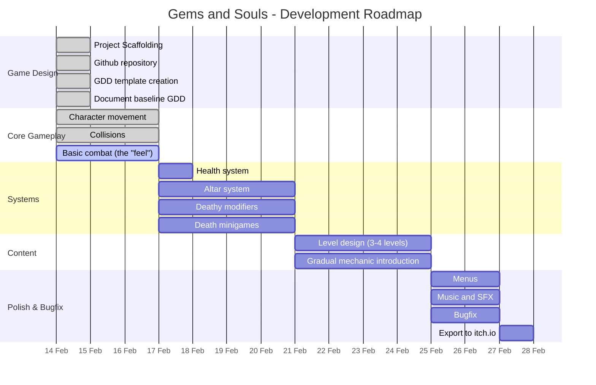

# Gems and Souls Roadmap

```mermaid
gantt
    title Gems and Souls - Development Roadmap
    dateFormat YYYY-MM-DD
    axisFormat %d %b

    section Game Design
    Project Scaffolding                 :done, design1, 2026-02-14, 1d
    Github repository                   :done, design2, 2026-02-14, 1d
    GDD template creation               :done, design3, 2026-02-14, 1d
    Document baseline GDD               :done, design4, 2026-02-14, 1d

    section Core Gameplay
    Character movement                 :done, core1, 2026-02-14, 3d
    Collisions                         :done, core2, 2026-02-14, 3d
    Basic combat (the "feel")          :active, core3, 2026-02-14, 3d

    section Systems
    Health system                      :sys0, 2026-02-17, 1d
    Altar system                       :sys1, 2026-02-17, 4d
    Deathy modifiers                   :sys2, 2026-02-17, 4d
    Death minigames                    :sys3, 2026-02-17, 4d

    section Content
    Level design (3-4 levels)          :cont1, 2026-02-21, 4d
    Gradual mechanic introduction      :cont2, 2026-02-21, 4d

    section Polish & Bugfix
    Menus                              :pol1, 2026-02-25, 2d
    Music and SFX                      :pol2, 2026-02-25, 2d
    Bugfix                             :pol3, 2026-02-25, 2d
    Export to itch.io                  :pol4, 2026-02-27, 1d
```
